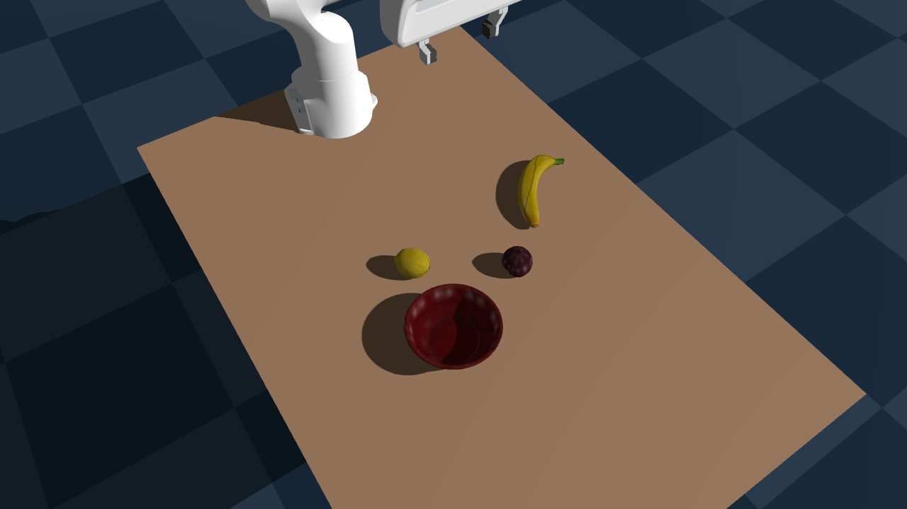
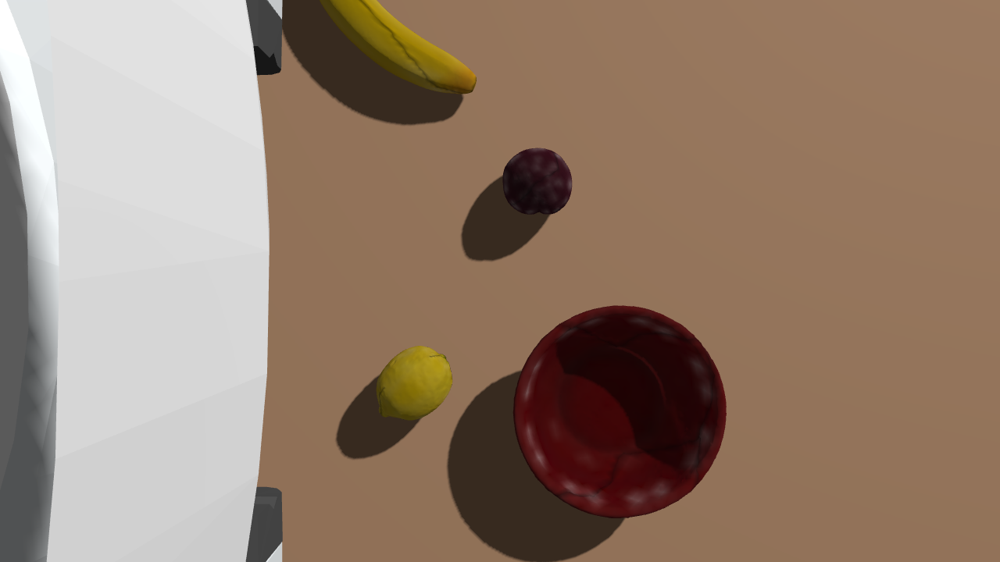

# Radeon Cloud Session A Evidence

Session A was run on 2026-07-24 using the AMD Radeon Cloud Blank OpenCode
Workspace.

Verified stack:

- Python 3.12.3
- PyTorch 2.9.1 (`gitff65f5b`)
- HIP 7.2.53211
- one visible AMD Radeon GPU
- Genesis GPU scene build and 20 simulation steps
- GuardianSim unit tests: 7/7 passed

The first cloud run exposed two compatible-version requirements that are now
pinned in `pyproject.toml`: NumPy must remain below 2.3 for Numba, while
`scikit-image` must be at least 0.25.2 for NumPy 2 ABI compatibility.

## Scene probe

World camera:

Wrist camera:

## Reference baseline

The retained reference policy completed the task
`011_banana -> 024_bowl` successfully and produced eight stage frames.

These artifacts prove environment and reference-policy readiness. They are not
GuardianSim comparative benchmark results; risk-ranked counterfactual evaluation
will be measured separately against fixed-seed baseline episodes.
