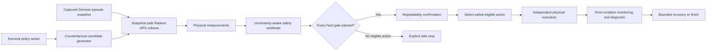

# GuardianSim: Counterfactual Safety Certification for Robot Manipulation on AMD Radeon GPUs

**Track:** Track 3 — Physical AI Challenge
**Project repository:** <https://github.com/nvm-star-max/GuardianSim>
**Team:** `[TEAM NAME — REQUIRED BEFORE SUBMISSION]`
**Members:** `[FULL NAME(S) AND CONTRIBUTIONS — REQUIRED BEFORE SUBMISSION]`

## Abstract

Robot manipulation policies are usually optimized to complete a task, but a
nominally successful grasp can still pass too close to nearby objects, contact
clutter, or become unstable when scene geometry changes. GuardianSim is a
safety-oriented decision layer for simulated Franka Panda fruit picking. Given
a nominal grasp, it generates counterfactual alternatives, restores every
alternative to the same Genesis scene snapshot, measures physical rollout
outcomes on an AMD Radeon GPU, and selects an action only when it satisfies
frozen reachability, stability, clearance, and repeatability requirements. If
no candidate passes every hard gate, the system explicitly stops.

In the primary frozen Gate 3.2 benchmark, GuardianSim achieved repeatable safe
completion in 30 of 30 unseen clutter scenarios, compared with 18 of 30 for the
nominal baseline. Across three independent physical executions per scenario,
safe executions improved from 58/90 to 90/90, while sampled clutter contacts
decreased from 30 to zero. Mean sampled clutter clearance increased from
0.023191 m to 0.046003 m. These are Genesis simulation results on AMD Radeon
Cloud, not physical-robot deployment claims.

## 1. Target application and motivation

The target application is safety-aware action selection for robot manipulation
in clutter. The retained reference task uses a Franka Panda arm to pick a
banana, lemon, or plum from a table and move it toward a bowl. A nominal
scripted policy can complete many layouts, but its fixed grasp orientation and
approach geometry do not explicitly reason about nearby clutter.

GuardianSim addresses a narrower and auditable question:

> Before executing a policy-proposed grasp, can a simulator evaluate bounded
> alternatives from the same physical state, reject actions that violate
> safety margins, and either execute a safer eligible action or stop?

The project focuses on the decision boundary rather than claiming a new
end-to-end robot foundation model. This makes every action choice inspectable
and every published metric traceable to a preserved report.

## 2. System architecture

The implementation is split into four layers:

1. **Simulator-independent decision core.** Candidate models, scoring,
   recovery logic, serialization, and benchmark validators do not depend on
   Genesis runtime objects.
2. **Snapshot-safe simulation adapter.** A captured episode state contains
   robot joints, object poses, and a deterministic fingerprint. Every candidate
   rollout restores this state before evaluation.
3. **Physical measurement layer.** Rollouts produce reachability, grasp
   alignment, retained-lift stability, path length, uncertainty, and minimum
   sampled clutter clearance. Support-surface contact is diagnosed separately
   from non-target clutter overlap.
4. **Safety-first selector.** Hard gates determine eligibility before utility
   ranking. The selector never falls back to an unsafe nominal action.

## 3. Method

### 3.1 Counterfactual action space

The initial candidate matrix varied grasp yaw and lateral gripper offsets. The
final Gate 3.2 action space was expanded after the Gate 3.1 negative result. It
contains 18 obstacle-aware candidates:

- yaw angles from -90 degrees to +90 degrees in 22.5-degree increments;
- the nominal target position;
- a 0.025 m retreat direction away from primary clutter;
- a raised 0.14 m approach for retreating candidates.

The nominal action remains represented explicitly, so GuardianSim can retain it
when it is already safe.

### 3.2 Snapshot identity

Comparing candidates from different physical states would invalidate the
counterfactual claim. GuardianSim therefore:

- captures one settled episode snapshot;
- fingerprints its robot and object state;
- restores the same snapshot before each candidate rollout;
- validates the fingerprint when resuming a report.

During development, strict resume validation correctly rejected two attempts to
append a smoke report from a newly initialized Genesis process whose base
snapshot fingerprint differed. Those rejected logs are preserved as audit
evidence.

### 3.3 Physical measurements

For each candidate, GuardianSim measures:

- inverse-kinematics reachability;
- grasp-axis alignment;
- retained object lift and stability;
- sampled path length;
- perception uncertainty;
- minimum AABB separation between distal arm links and named non-target
  clutter.

A diagnostic identifies the responsible sample, robot link, obstacle, overlap
state, and overlap depth. Table support contact is recorded separately and does
not determine clutter collision risk.

### 3.4 Safety eligibility and repeatability

Gate 3.2 freezes all thresholds before the formal run. A candidate is eligible
only if its conservative aggregate passes every reachability, stability, and
minimum-clearance gate. Candidate confirmation uses repeated rollouts; formal
execution then independently executes each strategy three times. An episode is
a repeatable safe completion only when all three executions pass.

The selector returns one of four explainable decision types:

- retain an eligible nominal action;
- use a higher-margin alternative;
- replace an unsafe nominal action;
- safe-stop because no action is eligible.

### 3.5 Post-condition monitoring

Independent execution records whether the gripper closed, object lift was
retained, clutter was contacted, the clearance threshold was violated, or the
lift became unstable. Failure diagnosis maps these observations to bounded
recovery actions. The benchmark does not count a visually plausible but unsafe
execution as a success.

## 4. Training and evaluation data

GuardianSim's primary results do not require a newly trained policy or an
external training dataset. The nominal action comes from the retained scripted
Franka fruit-picking reference pipeline. The contribution is the
counterfactual safety layer and its physical evaluation.

The frozen Gate 3.2 evaluation matrix contains 30 procedurally declared,
previously unseen scenarios:

- three target objects: banana, lemon, and plum;
- lateral and radial clutter configurations;
- five deterministic seeds per object/configuration cell;
- three independent physical executions for each strategy and scenario.

The scenario order, thresholds, protocol hash, and matrix hash were frozen
before the formal outcomes were inspected:

- protocol SHA-256:
  `8f23247001e05f39817225ed13f028321fbb9b9c694aaacd5b987fe61ee1fb3c`;
- matrix SHA-256:
  `69f87994b87f2def788cd944ad75210cdeddeafcaa3d0a3844fef04efca9cb03`.

Gate 3.3 adds engineering breadth tests for pose shift and changed
gap/bearing. Its completed 12-scenario prefix is reported separately and is
not combined with the primary 30-scenario performance claim.

## 5. AMD Radeon GPU use

The formal benchmark and evaluator smoke ran on AMD Radeon Cloud using the
Genesis `gs.amdgpu` backend.

Recorded formal environment:

- AMD Radeon Cloud Blank OpenCode Workspace;
- one AMD Radeon device, PCI model `0x744b`, GFX architecture `gfx1100`;
- approximately 47.98 GB device memory reported by Genesis;
- Python 3.12.3;
- PyTorch `2.9.1+gitff65f5b`;
- HIP `7.2.53211-e1a6bc5663`;
- Genesis 1.2.3.

The GPU accelerates Genesis scene stepping and the repeated physical
counterfactual rollouts. Mean Gate 3.2 planning wall time was 264.95 seconds per
scenario for the frozen candidate and confirmation protocol. Mean independent
execution time was 9.08 seconds for the baseline and 8.94 seconds for
GuardianSim.

The repository includes exact ROCm wheel installation, a dependency lock, an
environment-manifest collector, a GPU-required preflight, a bounded
three-candidate Genesis smoke, and a complete-source ROCm Dockerfile.

## 6. Results

### 6.1 Primary Gate 3.2 result

| Metric | Nominal baseline | GuardianSim | Difference |
| --- | ---: | ---: | ---: |
| Repeatable safe completion | 18/30 (60%) | 30/30 (100%) | +40.00 percentage points |
| Independent safe executions | 58/90 | 90/90 | +32 executions |
| Clutter-contact executions | 30 | 0 | -30 |
| Mean sampled clutter clearance | 0.023191 m | 0.046003 m | +98.36% |
| Mean retained-lift stability | 0.892762 | 0.905099 | +0.012337 |

GuardianSim decisions comprised 11 higher-margin alternatives, 10 replacements
of unsafe nominal actions, and nine eligible nominal fallbacks. No Gate 3.2
scenario required a safe stop.

### 6.2 Negative evidence and iteration

Gate 3.1 is intentionally retained. It showed that increasing average
clearance alone did not improve safe-completion rate. This negative result
motivated three Gate 3.2 changes:

- expanded obstacle-aware action geometry;
- an explicit rule forbidding fallback to an unsafe nominal action;
- three independent physical executions for repeatability.

### 6.3 Breadth evidence and limitation

In the independent 12-scenario Gate 3.3 prefix, GuardianSim executed ten
actions safely and safe-stopped twice, with zero clutter contacts or
clearance-violating executions. The nominal baseline completed seven safely,
made four clutter contacts, and had one clearance violation.

The two stops occurred in lateral lemon and plum gap/bearing cases where no
candidate satisfied all frozen hard gates. This is correct fail-safe behavior,
but it exposes a real action-space coverage limitation. GuardianSim does not
claim universal completion under arbitrary geometry.

## 7. Innovation and technical contributions

1. **Counterfactual safety layer rather than another task policy.** GuardianSim
   can wrap a policy-proposed action and reason about alternatives before
   physical execution.
2. **Snapshot-safe candidate comparison.** Every alternative is evaluated from
   an identical fingerprinted scene state, and incompatible cross-process
   resumes are rejected.
3. **Hard eligibility before ranking.** Utility cannot compensate for failed
   safety requirements; no eligible action results in an explicit stop.
4. **Repeatability-aware evidence.** Formal success requires three independent
   safe executions rather than one favorable rollout.
5. **Explainable diagnostics and audit trail.** Reports preserve physical
   metrics, responsible links/obstacles, decision taxonomy, frozen protocol
   identity, logs, and checksums.
6. **Failure-driven development.** The preserved Gate 3.1 negative result and
   Gate 3.3 safe-stop limitation constrain the claims and guide future work.

## 8. Reproducibility and deliverables

Primary deliverables:

- source code and bundled simulation assets;
- `uv.lock` and exact Radeon wheel installer;
- complete-source ROCm Dockerfile;
- machine-readable environment capture;
- one-command source/GPU preflight;
- bounded real Genesis counterfactual smoke;
- immutable Gate 3.2 schema-5 report and validator;
- Gate 3.3 breadth evidence;
- annotated comparison demo and interactive showcase;
- technical report and 3–5 minute video.

The evaluator path is documented in the repository root
`REPRODUCIBILITY.md`. The formal report validator must reproduce 30 episodes
and the frozen protocol hash before any primary metric is accepted.

## 9. Limitations and responsible claims

- All evidence comes from Genesis simulation.
- No physical robot was tested.
- Axis-aligned sampled clearance is an engineering proxy, not a formal
  continuous-time collision proof.
- The evaluated object set is limited to three YCB fruits and declared clutter
  configurations.
- Planning is not yet real-time.
- Safe stopping protects against unsupported geometry but reduces task
  completion.
- The reported 30-scenario result applies only to the frozen Gate 3.2 matrix.

Future work should expand continuous grasp geometry, use richer collision
distance models, calibrate perception uncertainty from camera observations,
reduce planning latency through parallel rollouts, and validate on physical
hardware.

## 10. Team contributions

> **Submission blocker:** replace every bracketed field below with verified
> legal names and contributions before export.

| Member | Contribution |
| --- | --- |
| `[FULL NAME]` | `[System design, implementation, experiments, documentation, video, or other verified work]` |

AI-assisted development tools were used for implementation and documentation
support. The submitting team remains responsible for technical validation,
claims, licenses, and competition-rule compliance.

## References

1. GuardianSim source and evidence:
   <https://github.com/nvm-star-max/GuardianSim>
2. Genesis Embodied AI:
   <https://github.com/Genesis-Embodied-AI/Genesis>
3. LeRobot:
   <https://github.com/huggingface/lerobot>
4. ROCm documentation:
   <https://rocm.docs.amd.com/>
5. Upstream Franka fruit-picking reference:
   <https://github.com/wangxunx/franka_fruit_pick_demo>
